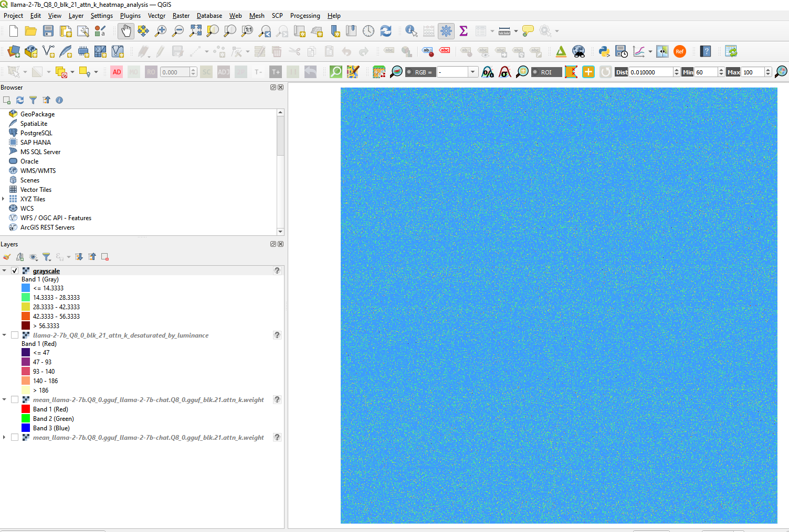
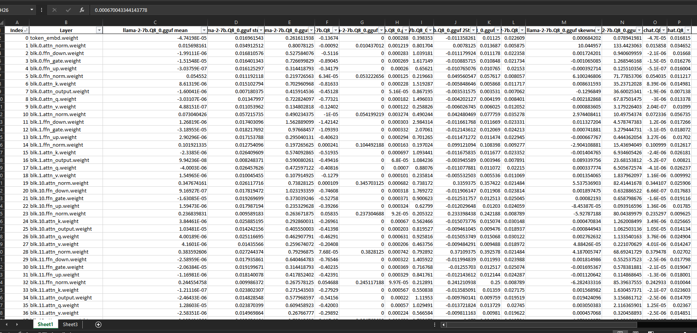

# GGUF Tools

Random tools and experiments for manipulating or viewing the GGUF file format. See:

1. https://github.com/ggerganov/llama.cpp
2. https://github.com/ggerganov/ggml

Forked from KerfuffleV2's original repo: https://github.com/KerfuffleV2/gguf-tools

## Scripts

All scripts support using `--help` for information on the commandline options.

### `gguf-checksum`

Allows calculating a model's SHA256 without being affected by the exact order of the fields in the file. It's also possible to get checksums of the individual tensors or metadata fields. **Note**: The overall hash will not match that from tools like `sha256sum` since it is based on a sorted version of the fields. The point of the tool is to allow comparing models in a way where the order of the tensors of fields does not affect the result.

**Examples:**

`gguf-checksum.py model.gguf` — Generate a full checksum for the model, including tensor data. At the end, you'll get a SHA256 for the KV metadata, the tensor metadata, the whole metadata section, the tensor data alone and the overall SHA256 with all sections included. As mentioned, this won't match a SHA256 based only on the raw file content.

`gguf-checksum.py --json model.gguf` — Same as above except the output will be in JSON format. Example:

```json
{ "kv_metadata": "426c351e4437c6084d7b67f0a55aa7ad206ecec619424e49ccb3763ecc47fa4f",
  "tensor_metadata": "5eb813b667e0a88108f9ea1aae49ca63b416797dc7e871f239acfbfab99a7c78",
  "tensor_data": "35f22466eb3521e4f121fc6b8deee850ab59dec0342a0ef56c06ace9b7266855",
  "metadata": "93113a12203aa873da48c594b572d4d2f1e90c2f79ba3c489e97b5d4ee69633a",
  "overall": "d4838aaca38a8b8742d417b7038f64f195a7f6c2a19db8ca13287ede72132bbc" }
```

`gguf-checksum.py --hash-individual-kvs --hash-individual-tensors model.gguf` — Same as the first, except you will also get a SHA256 for each individual KV and each tensor's data. Example:

```plaintext
[...]
HASH KV              60319eb94a7e6ccb90415531d683e4602ea9bc2b9b737458a88a831bd7b898d3 'general.architecture'
HASH KV              701aaf18cc8024bc5623b098ae765c81357de9b56fae5072b007ad28767e88c7 'general.file_type'
[...]
HASH TENSOR          0cc4e78473416068323151762dee07c18a09b796a86b9a8cfafe8a7ac4c7a600 'blk.0.attn_k.weight'
HASH TENSOR          32e2dd836ba8a3d81a7937456662e181da1f53343f9d11a755ff6b27283c2241 'blk.0.attn_norm.weight'
HASH TENSOR          dc856d2f9bc97c202a48cb5df2c8951eb68dc7b5c8683d9a9f268c65bc094cf4 'blk.0.attn_output.weight'
```

***

### `gguf-frankenstein`

You supply an input metadata GGUF file and optionally an input tensor data GGUF file and this utility will stitch the two together into a new GGUF file. When the tensor data file isn't specified, you end up with a vocab-only model that just has the metadata. This could be used for future Frankenstein-ing or training a model with that vocab/metadata as the base.

**Examples:**

`gguf-frankenstein.py --metadata md.gguf --tensor td.gguf --output result.gguf` — Create `result.gguf` with the key/value metadata from `md.gguf` and the tensor data (and tensor metadata) from `td.gguf`.

`gguf-frankenstein.py --metadata md.gguf --output result.gguf` — Create `result.gguf` with the key/value metadata from `md.gguf`. This will be a vocab-only model that could be used for training.

***

### `gguf-tensor-to-image`

Despite the name (and repo) this actually can handle Torch models as well if you have Torch Python support installed. Converts a tensor or tensors to an image representation. See the `CFG_` values near the top. Some tensors are more interesting than others. Check out an `attn_q` tensor if you get the chance. Oh baby, there's a lot going on. For GGUF, the script can deal with `F32`, `F16` and `Q8_0` tensors and includes a tiny `Q8_0` quantization/dequantization implementation. For Torch, it supports tensors in `float32`, `float16` and `bfloat16` formats.

Here's what it can look like (little slice of an Orca 3B `attn_q`):


 **Examples:**

 `gguf-tensor-to-image.py --output out.png model.gguf output.weight` — Save the `output.weight` tensor in `model.gguf` as `out.png`

 `gguf-tensor-to-image.py --output out.png model.gguf output.weight token_embd.weight` — Save the specified tensors in `model.gguf` as `output.weight.out.png` and `token_embd.weight.out.png`

 `gguf-tensor-to-image.py --output ./imgs/tensor.png model.gguf '*'` — Save all tensors in `model.gguf` like `./imgs/output.weight.tensor.png`. *Note*: Be sure to quote or escape `*` when specifying it as an option.

***
### `image_diff_heatmapper_mk2`

Takes a specified layer from two large language models, normalizes their tensor values, takes their difference, then maps them to a heatmap raster. Grayscale is the most appropriate output (although other options are available), as it can then be turned into a false color image using GIS mapping software such as QGIS or ArcGIS. Heatmaps of differences are useful for intuitively identifying the impact that fine-tuning has had on an instruct model. Use with the associated batch file `program_start_image_diff_heatmapper_mk2` is recommended

Here's an example in QGIS of a false color heatmap (`grayscale`) of the differences between Llama-2-7b 8-bit and Llama-2-Chat-7b 8-bit in their Block 21 Attention K layer.


Direct differences and differences in deviations from other central tendency (e.g. Median) are forthcoming.

**Examples:**

`image_diff_heatmapper_mk2.py model1.gguf model2.gguf output.weight --comparison_type=mean --color_mode=grayscale --output_path=out.png` - Compare the differences in standard deviations away from the normalized `mean` in `output.weight` between `model1.gguf` and `model2.gguf` and output a `grayscale` heatmap of the magnitudes of these differences to the image `out.png`.
***
### `gguf_compare_models_sum_stats`

Takes two models, pulls and flattens their tensors, performs summary statistics on those layers, and saves these statistics to an Excel file. Current output statistics include: 
1. mean
2. standard deviation
3. maximum
4. minimum
5. median
6. variance
7. range
8. 25th percentile
9. 75th percentile
10. IQR
11. skewness
12. kurtosis
    
Note that both models need to have the same number of layers and the Excel file must already exist in order for the program to work. Use with the associated batch file `program_start_gguf_compare_models_sum_stats` is recommended.


Single model statistics and other statistical measures are forthcoming.

**Examples:**

`gguf_compare_models_sum_stats.py model1.gguf model2.gguf output.xlsx` - Output summary statistics for `model1.guff` and `model2.gguf` to `output.xlsx`.

## Disclaimer

These scripts are experimental and likely not very well tested. They may or may not work. Use at your own risk.
